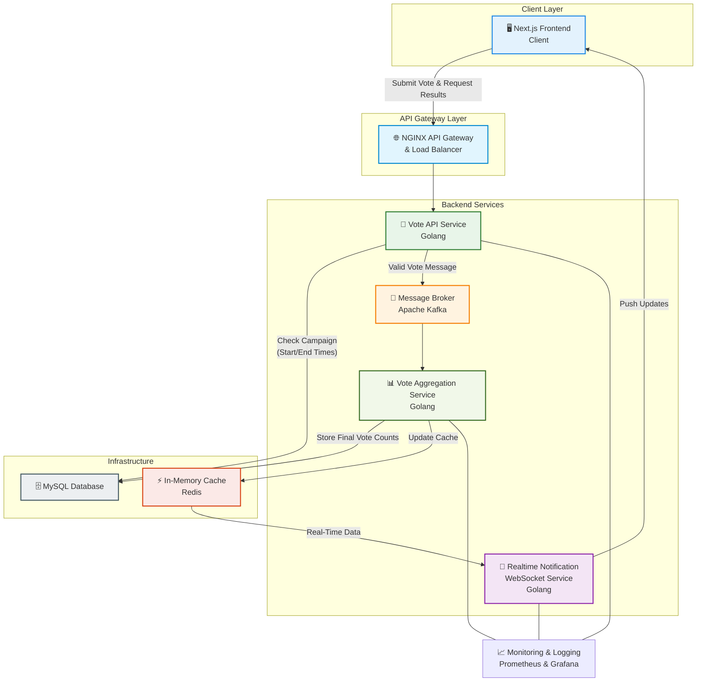

<h1 style="width: 100%; text-align: center;">Realtime polling system with GO</h1>

# Project Votify

One Paragraph of project description goes here

## Getting Started

These instructions will get you a copy of the project up and running on your local machine for development and testing purposes. See deployment for notes on how to deploy the project on a live system.

## High-level design



## Folder Structure

```plaintext
Votify/
├── README.md
├── .gitignore
├── docker-compose.yml             # Local orchestration including MySQL, Kafka, Redis, etc.
├── k8s/                           # Kubernetes deployment configurations
│   ├── namespaces.yaml
│   ├── mysql-deployment.yaml
│   ├── mysql-service.yaml
│   ├── frontend-deployment.yaml
│   ├── frontend-service.yaml
│   ├── vote-api-deployment.yaml
│   ├── vote-api-service.yaml
│   ├── vote-aggregator-deployment.yaml
│   ├── vote-aggregator-service.yaml
│   ├── realtime-notification-deployment.yaml
│   ├── realtime-notification-service.yaml
│   ├── kafka-deployment.yaml
│   ├── kafka-service.yaml
│   └── redis-deployment.yaml
├── frontend/                      # Next.js frontend code
│   ├── Dockerfile
│   ├── package.json
│   ├── next.config.js
│   ├── public/
│   └── src/
│       ├── components/
│       ├── pages/
│       └── styles/
├── backend/                       # Backend services code
│   ├── vote-api-service/          # Vote API Service (Golang)
│   │   ├── Dockerfile
│   │   ├── main.go
│   │   ├── go.mod
│   │   └── go.sum
│   ├── vote-aggregator-service/   # Vote Aggregation Service (Golang)
│   │   ├── Dockerfile
│   │   ├── main.go
│   │   ├── go.mod
│   │   └── go.sum
│   └── realtime-notification-service/   # Real-Time Notification (WebSocket)
│       ├── Dockerfile
│       ├── main.go
│       ├── go.mod
│       └── go.sum
├── infra/                         # Infrastructure configuration
│   ├── nginx/                     # NGINX API Gateway configuration
│   │   ├── Dockerfile
│   │   └── default.conf
│   ├── kafka/                     # Apache Kafka configuration
│   │   ├── Dockerfile
│   │   └── config/
│   │       └── server.properties
│   ├── redis/                     # Redis configuration
│   │   └── redis.conf
│   └── mysql/                     # MySQL configuration
│       ├── Dockerfile             # Optional (or use official image)
│       └── my.cnf
└── scripts/                       # Utility scripts for deployment
    └── deploy.sh
```

## Architecture Overview

### Client Layer
- **Next.js Frontend:**  
  - Provides a user interface for submitting votes and viewing real-time results.
  - Communicates with backend services through the NGINX API Gateway.

### API Gateway Layer
- **NGINX API Gateway & Load Balancer:**  
  - Routes incoming requests to the appropriate backend services.
  - Ensures efficient distribution of load across services.

### Backend Services
- **Vote API Service (Golang):**  
  - Receives vote submissions from the frontend.
  - Checks campaign metadata (start and end times) stored in MySQL before accepting votes.
  - Forwards valid votes to the Kafka message broker.

- **Message Broker (Apache Kafka):**  
  - Handles asynchronous vote processing by queuing vote messages.

- **Vote Aggregation Service (Golang):**  
  - Consumes vote messages from Kafka.
  - Aggregates votes in real time, temporarily caching results in Redis.
  - Persists final vote counts into MySQL after the campaign ends.

- **Realtime Notification Service (Golang WebSocket):**  
  - Pushes live updates to the frontend based on real-time data from Redis.

### Infrastructure Services
- **Redis:**  
  - Provides an in-memory cache for fast retrieval of real-time voting data.
- **MySQL:**  
  - Stores campaign metadata (vote topics, start/end times) and final vote results.
- **NGINX (Infra):**  
  - Configured as an API Gateway to route client requests.
  
### Additional Components
- **Monitoring & Logging:**  
  - Components such as Prometheus and Grafana can be attached to monitor system health and performance.
- **Time-Constrained Voting:**  
  - Each vote topic includes start and end times. Votes outside this window are rejected.
- **Deployment:**  
  - The system is containerized with Docker.
  - Local development uses Docker Compose for multi-container orchestration.
  - Production deployment is handled via Kubernetes with dedicated YAML configurations for each service.
