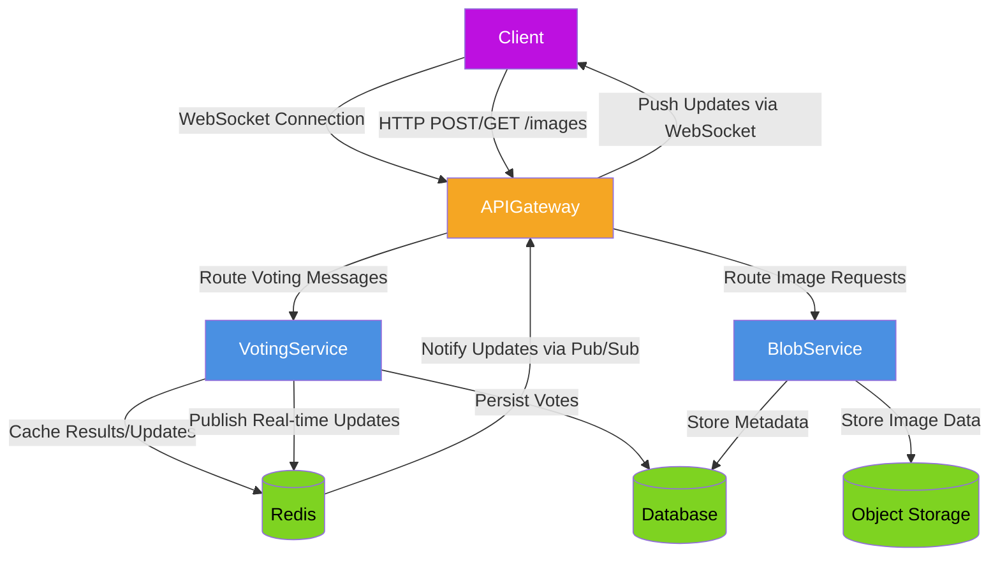

<h1 style="width: 100%; text-align: center;">Realtime polling system with GO</h1>

# Project Votify

One Paragraph of project description goes here

## Getting Started

These instructions will get you a copy of the project up and running on your local machine for development and testing purposes. See deployment for notes on how to deploy the project on a live system.

## High-level design



```
voting-service/
├── cmd/
│   └── main.go
├── internal/
│   ├── core/
│   │   ├── domain/
│   │   │   ├── vote.go          # Entity
│   │   │   └── election.go      # Aggregate root
│   │   ├── ports/
│   │   │   ├── repository.go    # Repository interfaces
│   │   │   ├── service.go       # Service interfaces
│   │   │   └── handler.go       # HTTP handlers interface
│   │   └── services/
│   │       └── voting_service.go # Domain service implementation
│   │
│   ├── adapters/
│   │   ├── handlers/
│   │   │   ├── http/
│   │   │   │   ├── vote_handler.go  # Gin handlers
│   │   │   │   └── websocket.go     # WebSocket implementation
│   │   │   └── cli/
│   │   ├── repositories/
│   │   │   ├── mysql/
│   │   │   │   ├── vote_repository.go # MySQL implementation
│   │   │   │   └── election_repository.go
│   │   │   └── redis/
│   │   │       └── cache_repository.go # Redis cache
│   │   └── storage/
│   │       └── minio/
│   │           └── image_storage.go    # MinIO adapter
│   │
│   └── infrastructure/
│       ├── database.go         # DB connection
│       ├── redis.go            # Redis client
│       └── minio.go            # MinIO client
│
├── pkg/
│   ├── config/
│   │   └── config.go           # Configuration loader
│   └── utils/
│       ├── logger.go
│       └── validator.go
│
├── configs/
│   └── default.yaml            # Default configuration
│
├── go.mod
├── go.sum
├── .env
└── Dockerfile
```
