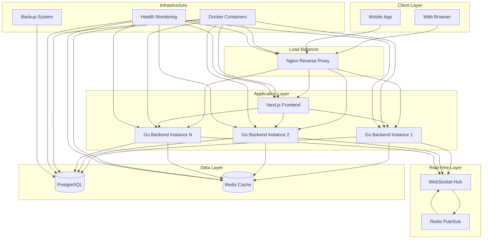

# Notify Chat Application

[](https://golang.org/)
[](https://nextjs.org/)
[](https://www.docker.com/)
[](LICENSE)

A high-performance, real-time chat application built with modern technologies, featuring WebSocket support, horizontal scaling capabilities, and production-ready deployment.

## 📋 Table of Contents

- [Project Summary](#-project-summary)
- [Highlight Features](#-highlight-features)
- [Performance Metrics](#-performance-metrics)
- [High-Level Design](#-high-level-design)
- [Detailed Design](#-detailed-design)
- [Monorepo Architecture](#️-monorepo-architecture)
- [Quick Start](#-quick-start)
- [Development](#-development)
- [Production Deployment](#-production-deployment)
- [Deployment Guide](./DEPLOYMENT.md)
- [API Documentation](#-api-documentation)
- [Contributing](#-contributing)
- [License & Copyright](#-license--copyright)

## 🚀 Project Summary

Notify Chat Application is a modern, scalable real-time messaging platform designed for high-performance communication. Built with a microservices architecture, it provides instant messaging capabilities with support for both direct and group conversations.

### Key Technologies
- **Monorepo**: PNPM workspace with Turborepo for parallel builds
- **Backend**: Express.js + TypeScript with TypeORM
- **Frontend**: Next.js 15 with React 19 and TypeScript
- **Database**: PostgreSQL 15 with Redis caching
- **Real-time**: Socket.IO WebSocket with horizontal scaling support
- **Deployment**: Vercel (frontend) + Render.com (backend) + Docker support

### Architecture Philosophy
- **Monorepo**: Single repository with shared packages for code reuse
- **Microservices**: Separated frontend and backend services
- **Real-time First**: WebSocket-based instant messaging
- **Scalable**: Redis pub/sub for horizontal scaling
- **Production Ready**: Comprehensive monitoring and health checks
- **Security First**: JWT authentication, rate limiting, and security headers
- **Type Safety**: Shared TypeScript types across frontend and backend

## ✨ Highlight Features

### Core Functionality
- ✅ **Real-time Messaging** - Instant message delivery via WebSocket
- ✅ **Channel Management** - Direct messages and group chats
- ✅ **User Authentication** - Secure JWT-based authentication
- ✅ **Profile Management** - User profiles with avatar support
- ✅ **Message History** - Persistent message storage and retrieval
- ✅ **Online Status** - Real-time user presence indicators

### Advanced Features
- ✅ **Horizontal Scaling** - Redis pub/sub for multi-instance support
- ✅ **Rate Limiting** - API and WebSocket connection throttling
- ✅ **Health Monitoring** - Comprehensive health checks and monitoring
- ✅ **Database Backups** - Automated backup and restore system
- ✅ **SSL/HTTPS Support** - Production-ready security
- ✅ **Docker Deployment** - Containerized with orchestration

### Developer Experience
- ✅ **Auto-generated APIs** - OpenAPI/Swagger documentation
- ✅ **Type Safety** - Full TypeScript support
- ✅ **Hot Reload** - Development with live reload
- ✅ **Testing Suite** - Comprehensive testing scripts
- ✅ **CI/CD Ready** - Production deployment automation

## 📊 Performance Metrics

### Estimated Throughput
- **Concurrent Users**: 10,000+ simultaneous connections
- **Messages per Second**: 1,000+ messages/second
- **API Requests**: 5,000+ requests/second
- **WebSocket Connections**: 10,000+ concurrent connections
- **Database Operations**: 2,000+ queries/second
- **Response Time**: < 100ms for API calls, < 50ms for WebSocket messages

### Resource Requirements
- **Minimum**: 4GB RAM, 2 CPU cores
- **Recommended**: 8GB RAM, 4 CPU cores
- **Production**: 16GB RAM, 8 CPU cores (with load balancing)

### Scalability
- **Horizontal Scaling**: Support for multiple backend instances
- **Database Scaling**: Read replicas and connection pooling
- **Cache Scaling**: Redis cluster support
- **Load Balancing**: Nginx with health checks

## 🏗️ High-Level Design



### Architecture Components

#### 1. **Client Layer**
- Web browsers and mobile applications
- Real-time WebSocket connections
- RESTful API consumption

#### 2. **Load Balancer (Nginx)**
- Reverse proxy and load balancing
- SSL termination
- Rate limiting and security headers
- Static asset serving

#### 3. **Application Layer**
- **Frontend**: Next.js with React 19
- **Backend**: Go microservices with Gin
- Horizontal scaling support
- Health monitoring

#### 4. **Real-time Layer**
- WebSocket hub for connection management
- Redis pub/sub for message broadcasting
- Channel-based messaging

#### 5. **Data Layer**
- **PostgreSQL**: Primary data storage
- **Redis**: Caching and session management
- Connection pooling and optimization

#### 6. **Infrastructure**
- Docker containerization
- Health monitoring and alerting
- Automated backup system

## 🏛️ Monorepo Architecture

This project uses a **PNPM workspace monorepo** structure for better code organization, shared types, and simplified development workflow.

### Project Structure

```
Notify/
├── apps/
│   ├── web/                    # Next.js Frontend Application
│   │   ├── src/
│   │   │   ├── app/            # Next.js App Router
│   │   │   ├── components/     # React components
│   │   │   ├── hooks/          # Custom React hooks
│   │   │   ├── lib/            # Utilities & configs
│   │   │   ├── services/       # API clients
│   │   │   └── store/         # Zustand state management
│   │   └── package.json
│   │
│   └── api/                     # Express.js Backend API
│       ├── src/
│       │   ├── config/         # Configuration
│       │   ├── controllers/    # Request handlers
│       │   ├── services/        # Business logic
│       │   ├── repositories/   # Data access layer
│       │   ├── entities/       # TypeORM entities
│       │   ├── middleware/     # Express middleware
│       │   ├── routes/         # Route definitions
│       │   ├── websocket/      # Socket.IO handlers
│       │   └── utils/          # Utilities
│       └── package.json
│
├── packages/
│   ├── types/                   # Shared TypeScript Types
│   │   ├── src/
│   │   │   ├── user.ts         # User interfaces
│   │   │   ├── channel.ts      # Channel interfaces
│   │   │   ├── chat.ts         # Chat/Message interfaces
│   │   │   ├── auth.ts         # Auth interfaces
│   │   │   └── index.ts        # Public exports
│   │   └── package.json
│   │
│   ├── validators/              # Shared Validation DTOs
│   │   ├── src/
│   │   │   ├── auth.dto.ts     # Auth DTOs (RegisterDto, LoginDto)
│   │   │   ├── channel.dto.ts  # Channel DTOs
│   │   │   ├── message.dto.ts  # Message DTOs
│   │   │   └── index.ts
│   │   └── package.json
│   │
│   └── shared/                  # Shared Utilities & Constants
│       ├── src/
│       │   ├── errors.ts       # Custom error classes
│       │   ├── helpers.ts      # Helper functions
│       │   ├── constants.ts    # Shared constants
│       │   └── index.ts
│       └── package.json
│
├── package.json                 # Root workspace config
├── pnpm-workspace.yaml          # Workspace definition
├── turbo.json                   # Turborepo configuration
└── vercel.json                  # Vercel deployment config
```

### Monorepo Benefits

1. **Shared Types**: TypeScript interfaces shared between frontend and backend via `@notify/types`
2. **Code Reuse**: Common utilities and validation logic in `@notify/shared` and `@notify/validators`
3. **Type Safety**: End-to-end type safety from API to UI
4. **Single Source of Truth**: One repository for all related code
5. **Parallel Builds**: Turborepo enables fast, parallel builds across packages
6. **Simplified Development**: Single `pnpm install` installs all dependencies

### Workspace Packages

- **`@notify/types`**: Shared TypeScript interfaces and types
  - Used by both frontend and backend
  - Ensures type consistency across the stack
  
- **`@notify/validators`**: Validation DTOs using class-validator
  - Used by backend for request validation
  - Can be shared with frontend for form validation
  
- **`@notify/shared`**: Shared utilities and constants
  - Error classes
  - Helper functions (date formatting, string utilities)
  - Constants

## 🔧 Detailed Design

### Backend Architecture
The backend service is built with Express.js + TypeScript and follows clean architecture principles:

- **📁 [Backend Documentation](./apps/api/README.md)**
  - API endpoints and Socket.IO handlers
  - Database models and repositories (TypeORM)
  - Business logic and services
  - Authentication and middleware
  - Real-time messaging implementation

### Frontend Architecture
The frontend is built with Next.js 15 and modern React patterns:

- **📁 [Frontend Documentation](./apps/web/README.md)**
  - Component architecture and design system
  - State management with Zustand
  - Real-time WebSocket integration
  - API client generation (Orval)
  - UI/UX implementation

### Deployment Architecture
Production-ready deployment to cloud platforms:

- **📁 [Deployment Documentation](./_docs/DEPLOYMENT.md)**
  - Vercel deployment (frontend)
  - Render.com deployment (backend)
  - Environment configuration
  - Database and Redis setup
  - Monitoring and health checks

### Database Schema
- **Users**: Authentication and profile management
- **Channels**: Direct messages and group chats
- **Messages**: Chat history with metadata
- **Relationships**: Many-to-many channel memberships

### Security Implementation
- **JWT Authentication**: Stateless token-based auth
- **Password Security**: bcrypt hashing with salt
- **Rate Limiting**: Redis-based throttling
- **CORS**: Cross-origin request handling
- **Security Headers**: XSS, CSRF protection
- **SSL/TLS**: Encrypted communication

## 🚀 Quick Start

### Prerequisites
- **Node.js**: >= 18.0.0
- **PNPM**: >= 8.0.0
- **PostgreSQL**: 13+ (for backend)
- **Redis**: 6+ (for backend)

### 1. Clone Repository
```bash
git clone <repository-url>
cd Notify
```

### 2. Install Dependencies
```bash
# Install all workspace dependencies
pnpm install
```

### 3. Setup Environment

**Backend (apps/api):**
```bash
cd apps/api
cp env.example .env
# Edit .env with your database and Redis configuration
```

**Frontend (apps/web):**
```bash
cd apps/web
# Create .env.local if needed for environment variables
```

### 4. Start Development

**Option A: Start both apps (recommended)**
```bash
# From root directory
pnpm dev
```

**Option B: Start individually**
```bash
# Frontend only
pnpm --filter @notify/web dev

# Backend only
pnpm --filter @notify/api dev
```

### 5. Access Application
- **Frontend**: http://localhost:3000
- **Backend API**: http://localhost:8080
- **API Documentation**: http://localhost:8080/swagger/ (if configured)

## 💻 Development

### Monorepo Commands

**Install dependencies:**
```bash
pnpm install                    # Install all workspace dependencies
pnpm --filter @notify/web install  # Install only frontend deps
pnpm --filter @notify/api install  # Install only backend deps
```

**Development:**
```bash
pnpm dev                        # Start all apps in dev mode
pnpm --filter @notify/web dev   # Start only frontend
pnpm --filter @notify/api dev   # Start only backend
```

**Build:**
```bash
pnpm build                      # Build all packages
pnpm --filter @notify/web build # Build only frontend
pnpm --filter @notify/api build # Build only backend
```

**Testing:**
```bash
pnpm test                       # Run all tests
pnpm --filter @notify/web test  # Test frontend
pnpm --filter @notify/api test  # Test backend
```

**Linting:**
```bash
pnpm lint                       # Lint all packages
pnpm --filter @notify/web lint  # Lint frontend
pnpm --filter @notify/api lint  # Lint backend
```

### Using Makefile (Alternative)

```bash
make install    # Install all dependencies
make dev        # Start both frontend and backend
make build      # Build all packages
make test       # Run all tests
make clean      # Clean build artifacts
```

### Backend Development
```bash
cd apps/api
pnpm dev        # Start with live reload (ts-node-dev)
pnpm test       # Run tests
pnpm lint       # Run linting
pnpm migration:run  # Run database migrations
```

### Frontend Development
```bash
cd apps/web
pnpm dev        # Start Next.js dev server
pnpm build      # Build for production
pnpm lint       # Run linting
pnpm gen:api    # Generate API client from OpenAPI
```

### Shared Packages Development
```bash
# Build shared packages
pnpm --filter @notify/types build
pnpm --filter @notify/validators build
pnpm --filter @notify/shared build
```

## 🚀 Production Deployment

### Cloud Deployment

This project supports deployment to modern cloud platforms:

- **Frontend**: Deploy to [Vercel](https://vercel.com) (recommended)
- **Backend**: Deploy to [Render.com](https://render.com) (recommended)
- **Database**: PostgreSQL on Render.com or managed service
- **Cache**: Redis on Render.com or managed service

**📖 [Complete Deployment Guide](./_docs/DEPLOYMENT.md)**

### Quick Deployment

**Frontend (Vercel):**
1. Connect your GitHub repository to Vercel
2. Set root directory to `apps/web`
3. Vercel will auto-detect Next.js and deploy

**Backend (Render.com):**
1. Create a new Web Service on Render.com
2. Connect your GitHub repository
3. Set root directory to `apps/api`
4. Configure environment variables
5. Set build command: `cd ../.. && pnpm install && pnpm --filter @notify/api build`
6. Set start command: `cd ../.. && pnpm --filter @notify/api start`

### Monitoring and Health Checks

**Vercel:**
- Go to **Deployments** → Click deployment → **Logs**
- Monitor build and runtime logs

**Render.com:**
- Go to your service → **Logs** tab
- Monitor for errors and performance
- Check health endpoints if configured

## 📚 API Documentation

### Interactive Documentation
- **Swagger UI**: http://localhost/swagger/
- **OpenAPI Spec**: Available in `/docs` directory

### API Endpoints
- **Authentication**: `/api/auth/login`, `/api/auth/register`
- **Users**: `/api/users/profile`, `/api/users/search`
- **Channels**: `/api/channels/`, `/api/channels/:id`
- **Messages**: `/api/messages/channel/:id`
- **WebSocket**: `/ws` for real-time communication

### WebSocket Events
- **Join Channel**: `channel.join`
- **Leave Channel**: `channel.leave`
- **Send Message**: `channel.message`
- **Connection**: `connection.connect`

## 🤝 Contributing

We welcome contributions! Please see our contributing guidelines:

1. **Fork the repository**
2. **Create a feature branch**: `git checkout -b feature/amazing-feature`
3. **Commit your changes**: `git commit -m 'Add amazing feature'`
4. **Push to the branch**: `git push origin feature/amazing-feature`
5. **Open a Pull Request**

### Development Guidelines
- Follow Go coding standards for backend
- Use TypeScript for frontend development
- Add tests for new features
- Update documentation as needed
- Use conventional commit messages

### Code Quality
- **Backend**: Go linting and testing
- **Frontend**: ESLint, Prettier, and TypeScript
- **Testing**: Unit and integration tests
- **Documentation**: Comprehensive API docs

## 📄 License & Copyright

### License
This project is licensed under the **MIT License** - see the [LICENSE](LICENSE) file for details.

```
MIT License

Copyright (c) 2024 Notify Chat Application

Permission is hereby granted, free of charge, to any person obtaining a copy
of this software and associated documentation files (the "Software"), to deal
in the Software without restriction, including without limitation the rights
to use, copy, modify, merge, publish, distribute, sublicense, and/or sell
copies of the Software, and to permit persons to whom the Software is
furnished to do so, subject to the following conditions:

The above copyright notice and this permission notice shall be included in all
copies or substantial portions of the Software.

THE SOFTWARE IS PROVIDED "AS IS", WITHOUT WARRANTY OF ANY KIND, EXPRESS OR
IMPLIED, INCLUDING BUT NOT LIMITED TO THE WARRANTIES OF MERCHANTABILITY,
FITNESS FOR A PARTICULAR PURPOSE AND NONINFRINGEMENT. IN NO EVENT SHALL THE
AUTHORS OR COPYRIGHT HOLDERS BE LIABLE FOR ANY CLAIM, DAMAGES OR OTHER
LIABILITY, WHETHER IN AN ACTION OF CONTRACT, TORT OR OTHERWISE, ARISING FROM,
OUT OF OR IN CONNECTION WITH THE SOFTWARE OR THE USE OR OTHER DEALINGS IN THE
SOFTWARE.
```

### Copyright
- **Copyright © 2024 Notify Chat Application**
- **Developed by**: Eric Nguyen
- **Repository**: [GitHub Repository](https://github.com/EricNguyen1206/Notify)

### Third-Party Licenses
This project uses several open-source libraries. Please refer to:
- **Backend Dependencies**: See `chat-service/go.mod`
- **Frontend Dependencies**: See `frontend/package.json`
- **Docker Images**: See respective Docker Hub pages

### Acknowledgments
- [Gin Web Framework](https://github.com/gin-gonic/gin) - Fast HTTP web framework
- [Next.js](https://nextjs.org/) - React framework for production
- [PostgreSQL](https://www.postgresql.org/) - Advanced open source database
- [Redis](https://redis.io/) - In-memory data structure store
- [Docker](https://www.docker.com/) - Containerization platform

---

## 📞 Support

For support and questions:
- **Issues**: [GitHub Issues](https://github.com/EricNguyen1206/Notify/issues)
- **Documentation**: [Project Wiki](https://github.com/EricNguyen1206/Notify/wiki)
- **Discussions**: [GitHub Discussions](https://github.com/EricNguyen1206/Notify/discussions)

---

⭐ **If you found this project helpful, please give it a star!**
