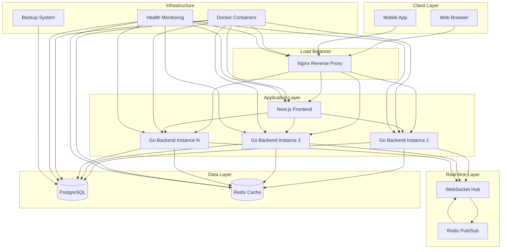

# Notify Chat Application

[](https://golang.org/)
[](https://nextjs.org/)
[](https://www.docker.com/)
[](LICENSE)

A high-performance, real-time chat application built with modern technologies, featuring WebSocket support, horizontal scaling capabilities, and production-ready deployment.

## 📋 Table of Contents

- [Project Summary](#-project-summary)
- [Highlight Features](#-highlight-features)
- [Performance Metrics](#-performance-metrics)
- [High-Level Design](#-high-level-design)
- [Detailed Design](#-detailed-design)
- [Quick Start](#-quick-start)
- [Development](#-development)
- [Production Deployment](#-production-deployment)
- [API Documentation](#-api-documentation)
- [Contributing](#-contributing)
- [License & Copyright](#-license--copyright)

## 🚀 Project Summary

Notify Chat Application is a modern, scalable real-time messaging platform designed for high-performance communication. Built with a microservices architecture, it provides instant messaging capabilities with support for both direct and group conversations.

### Key Technologies
- **Backend**: Go 1.23 with Gin framework
- **Frontend**: Next.js 15 with React 19 and TypeScript
- **Database**: PostgreSQL 15 with Redis caching
- **Real-time**: WebSocket with horizontal scaling support
- **Deployment**: Docker with production-ready configuration

### Architecture Philosophy
- **Microservices**: Separated frontend and backend services
- **Real-time First**: WebSocket-based instant messaging
- **Scalable**: Redis pub/sub for horizontal scaling
- **Production Ready**: Comprehensive monitoring and health checks
- **Security First**: JWT authentication, rate limiting, and security headers

## ✨ Highlight Features

### Core Functionality
- ✅ **Real-time Messaging** - Instant message delivery via WebSocket
- ✅ **Channel Management** - Direct messages and group chats
- ✅ **User Authentication** - Secure JWT-based authentication
- ✅ **Profile Management** - User profiles with avatar support
- ✅ **Message History** - Persistent message storage and retrieval
- ✅ **Online Status** - Real-time user presence indicators

### Advanced Features
- ✅ **Horizontal Scaling** - Redis pub/sub for multi-instance support
- ✅ **Rate Limiting** - API and WebSocket connection throttling
- ✅ **Health Monitoring** - Comprehensive health checks and monitoring
- ✅ **Database Backups** - Automated backup and restore system
- ✅ **SSL/HTTPS Support** - Production-ready security
- ✅ **Docker Deployment** - Containerized with orchestration

### Developer Experience
- ✅ **Auto-generated APIs** - OpenAPI/Swagger documentation
- ✅ **Type Safety** - Full TypeScript support
- ✅ **Hot Reload** - Development with live reload
- ✅ **Testing Suite** - Comprehensive testing scripts
- ✅ **CI/CD Ready** - Production deployment automation

## 📊 Performance Metrics

### Estimated Throughput
- **Concurrent Users**: 10,000+ simultaneous connections
- **Messages per Second**: 1,000+ messages/second
- **API Requests**: 5,000+ requests/second
- **WebSocket Connections**: 10,000+ concurrent connections
- **Database Operations**: 2,000+ queries/second
- **Response Time**: < 100ms for API calls, < 50ms for WebSocket messages

### Resource Requirements
- **Minimum**: 4GB RAM, 2 CPU cores
- **Recommended**: 8GB RAM, 4 CPU cores
- **Production**: 16GB RAM, 8 CPU cores (with load balancing)

### Scalability
- **Horizontal Scaling**: Support for multiple backend instances
- **Database Scaling**: Read replicas and connection pooling
- **Cache Scaling**: Redis cluster support
- **Load Balancing**: Nginx with health checks

## 🏗️ High-Level Design



### Architecture Components

#### 1. **Client Layer**
- Web browsers and mobile applications
- Real-time WebSocket connections
- RESTful API consumption

#### 2. **Load Balancer (Nginx)**
- Reverse proxy and load balancing
- SSL termination
- Rate limiting and security headers
- Static asset serving

#### 3. **Application Layer**
- **Frontend**: Next.js with React 19
- **Backend**: Go microservices with Gin
- Horizontal scaling support
- Health monitoring

#### 4. **Real-time Layer**
- WebSocket hub for connection management
- Redis pub/sub for message broadcasting
- Channel-based messaging

#### 5. **Data Layer**
- **PostgreSQL**: Primary data storage
- **Redis**: Caching and session management
- Connection pooling and optimization

#### 6. **Infrastructure**
- Docker containerization
- Health monitoring and alerting
- Automated backup system

## 🔧 Detailed Design

### Backend Architecture
The backend service is built with Go and follows clean architecture principles:

- **📁 [Backend Documentation](./chat-service/README.md)**
  - API endpoints and WebSocket handlers
  - Database models and repositories
  - Business logic and services
  - Authentication and middleware
  - Real-time messaging implementation

### Frontend Architecture
The frontend is built with Next.js 15 and modern React patterns:

- **📁 [Frontend Documentation](./frontend/README.md)**
  - Component architecture and design system
  - State management with Zustand
  - Real-time WebSocket integration
  - API client generation
  - UI/UX implementation

### Deployment Architecture
Production-ready deployment with Docker and orchestration:

- **📁 [Deployment Documentation](./deployments/README.md)**
  - Docker containerization
  - Docker Compose orchestration
  - Nginx configuration
  - SSL/HTTPS setup
  - Monitoring and health checks

### Database Schema
- **Users**: Authentication and profile management
- **Channels**: Direct messages and group chats
- **Messages**: Chat history with metadata
- **Relationships**: Many-to-many channel memberships

### Security Implementation
- **JWT Authentication**: Stateless token-based auth
- **Password Security**: bcrypt hashing with salt
- **Rate Limiting**: Redis-based throttling
- **CORS**: Cross-origin request handling
- **Security Headers**: XSS, CSRF protection
- **SSL/TLS**: Encrypted communication

## 🚀 Quick Start

### Prerequisites
- Docker and Docker Compose
- 4GB+ RAM available
- Ports 80, 3000, 8080, 5432, 6379 available

### 1. Clone Repository
```bash
git clone <repository-url>
cd Notify
```

### 2. Setup Environment
```bash
cd deployments/docker
cp env.example .env
# Edit .env with your configuration
```

### 3. Deploy Application
```bash
# Automated setup
./setup.sh

# Or manually
docker compose up -d
```

### 4. Access Application
- **Frontend**: http://localhost
- **API**: http://localhost/api
- **Documentation**: http://localhost/swagger/

### 5. Test Credentials
- **Email**: admin@notify.com
- **Password**: 123456

## 💻 Development

### Backend Development
```bash
cd chat-service
make dev          # Start with live reload
make test         # Run tests
make swagger      # Generate API docs
```

### Frontend Development
```bash
cd frontend
npm run dev       # Start development server
npm run build     # Build for production
npm run lint      # Run linting
```

### Full Development Environment
```bash
make dev          # Start both frontend and backend
make test         # Run all tests
make build        # Build everything
```

## 🚀 Production Deployment

### Docker Deployment
```bash
cd deployments/docker
./setup.sh        # Automated production setup
```

### Manual Production Setup
```bash
# Use production configuration
docker compose -f docker-compose.yml -f docker-compose.prod.yml up -d
```

### SSL/HTTPS Setup
```bash
# Generate SSL certificates
mkdir ssl
openssl req -x509 -nodes -days 365 -newkey rsa:2048 \
  -keyout ssl/key.pem -out ssl/cert.pem

# Update nginx configuration
cp ../nginx-ssl.conf ../nginx.conf
docker compose restart nginx
```

### Monitoring and Health Checks
```bash
# Check service health
docker compose ps

# View logs
docker compose logs -f

# Test deployment
./test-deployment.sh
```

## 📚 API Documentation

### Interactive Documentation
- **Swagger UI**: http://localhost/swagger/
- **OpenAPI Spec**: Available in `/docs` directory

### API Endpoints
- **Authentication**: `/api/auth/login`, `/api/auth/register`
- **Users**: `/api/users/profile`, `/api/users/search`
- **Channels**: `/api/channels/`, `/api/channels/:id`
- **Messages**: `/api/messages/channel/:id`
- **WebSocket**: `/ws` for real-time communication

### WebSocket Events
- **Join Channel**: `channel.join`
- **Leave Channel**: `channel.leave`
- **Send Message**: `channel.message`
- **Connection**: `connection.connect`

## 🤝 Contributing

We welcome contributions! Please see our contributing guidelines:

1. **Fork the repository**
2. **Create a feature branch**: `git checkout -b feature/amazing-feature`
3. **Commit your changes**: `git commit -m 'Add amazing feature'`
4. **Push to the branch**: `git push origin feature/amazing-feature`
5. **Open a Pull Request**

### Development Guidelines
- Follow Go coding standards for backend
- Use TypeScript for frontend development
- Add tests for new features
- Update documentation as needed
- Use conventional commit messages

### Code Quality
- **Backend**: Go linting and testing
- **Frontend**: ESLint, Prettier, and TypeScript
- **Testing**: Unit and integration tests
- **Documentation**: Comprehensive API docs

## 📄 License & Copyright

### License
This project is licensed under the **MIT License** - see the [LICENSE](LICENSE) file for details.

```
MIT License

Copyright (c) 2024 Notify Chat Application

Permission is hereby granted, free of charge, to any person obtaining a copy
of this software and associated documentation files (the "Software"), to deal
in the Software without restriction, including without limitation the rights
to use, copy, modify, merge, publish, distribute, sublicense, and/or sell
copies of the Software, and to permit persons to whom the Software is
furnished to do so, subject to the following conditions:

The above copyright notice and this permission notice shall be included in all
copies or substantial portions of the Software.

THE SOFTWARE IS PROVIDED "AS IS", WITHOUT WARRANTY OF ANY KIND, EXPRESS OR
IMPLIED, INCLUDING BUT NOT LIMITED TO THE WARRANTIES OF MERCHANTABILITY,
FITNESS FOR A PARTICULAR PURPOSE AND NONINFRINGEMENT. IN NO EVENT SHALL THE
AUTHORS OR COPYRIGHT HOLDERS BE LIABLE FOR ANY CLAIM, DAMAGES OR OTHER
LIABILITY, WHETHER IN AN ACTION OF CONTRACT, TORT OR OTHERWISE, ARISING FROM,
OUT OF OR IN CONNECTION WITH THE SOFTWARE OR THE USE OR OTHER DEALINGS IN THE
SOFTWARE.
```

### Copyright
- **Copyright © 2024 Notify Chat Application**
- **Developed by**: Eric Nguyen
- **Repository**: [GitHub Repository](https://github.com/EricNguyen1206/Notify)

### Third-Party Licenses
This project uses several open-source libraries. Please refer to:
- **Backend Dependencies**: See `chat-service/go.mod`
- **Frontend Dependencies**: See `frontend/package.json`
- **Docker Images**: See respective Docker Hub pages

### Acknowledgments
- [Gin Web Framework](https://github.com/gin-gonic/gin) - Fast HTTP web framework
- [Next.js](https://nextjs.org/) - React framework for production
- [PostgreSQL](https://www.postgresql.org/) - Advanced open source database
- [Redis](https://redis.io/) - In-memory data structure store
- [Docker](https://www.docker.com/) - Containerization platform

---

## 📞 Support

For support and questions:
- **Issues**: [GitHub Issues](https://github.com/EricNguyen1206/Notify/issues)
- **Documentation**: [Project Wiki](https://github.com/EricNguyen1206/Notify/wiki)
- **Discussions**: [GitHub Discussions](https://github.com/EricNguyen1206/Notify/discussions)

---

⭐ **If you found this project helpful, please give it a star!**
