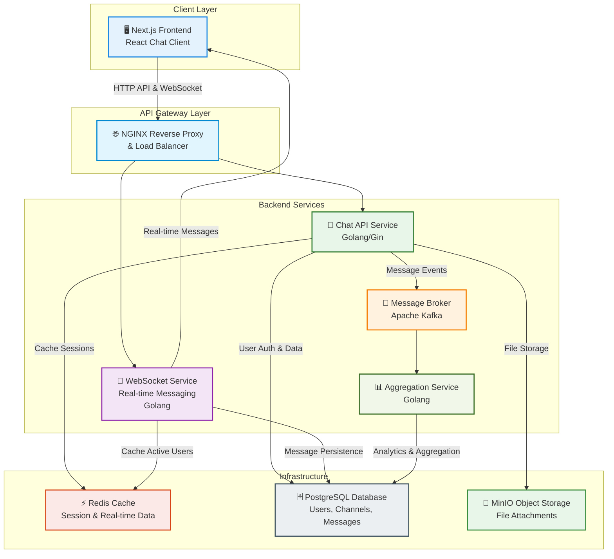

<h1 style="width: 100%; text-align: center;">Real-time Chat Application with Go & Next.js</h1>

# Project Notify - Chat Service

A modern real-time chat application built with Go backend and Next.js frontend, featuring WebSocket communication, user authentication, and channel-based messaging.

## Getting Started

These instructions will get you a copy of the project up and running on your local machine for development and testing purposes. Please refer to the [Makefile Guide](MAKEFILE_GUIDE.md) for detailed instructions on how to set up the project.

## High-level Architecture



## Project Structure

```plaintext
Notify/
├── README.md                      # Project documentation
├── deployments/                   # Deployment configurations
│   ├── README.md                  # Deployment guide and documentation
│   ├── nginx.conf                 # NGINX reverse proxy configuration
│   ├── docker/                    # Docker deployment files
│   │   ├── docker-compose.yml     # Complete service orchestration
│   │   └── .env.example           # Environment variables template
│   └── k8s/                       # Kubernetes deployment configurations
│       ├── deployment.yml         # Kubernetes deployment manifest
│       └── service.yml            # Kubernetes service manifest
├── frontend/                      # Next.js React frontend application
│   ├── Dockerfile                 # Multi-stage optimized container build
│   ├── package.json               # Node.js dependencies and scripts
│   ├── next.config.mjs            # Next.js configuration (standalone output)
│   ├── tailwind.config.ts         # Tailwind CSS configuration
│   ├── tsconfig.json              # TypeScript configuration
│   ├── components.json            # UI components configuration
│   ├── orval.config.ts            # API client generation config
│   ├── public/                    # Static assets
│   │   ├── images/                # Image assets
│   │   └── *.svg                  # Icon files
│   ├── src/                       # Source code
│   │   ├── app/                   # Next.js App Router pages
│   │   │   ├── (auth)/            # Authentication pages (login, register)
│   │   │   ├── api/               # API routes
│   │   │   │   └── health/        # Health check endpoint
│   │   │   ├── messages/          # Chat messages pages
│   │   │   ├── layout.tsx         # Root layout component
│   │   │   └── page.tsx           # Home page
│   │   ├── components/            # React components (Atomic Design)
│   │   │   ├── atoms/             # Basic UI elements
│   │   │   ├── molecules/         # Component combinations
│   │   │   ├── organisms/         # Complex components
│   │   │   ├── templates/         # Page templates
│   │   │   └── ui/                # Reusable UI components
│   │   ├── hooks/                 # Custom React hooks
│   │   ├── lib/                   # Utility libraries
│   │   │   ├── supabase/          # Supabase client configuration
│   │   │   └── utils/             # Helper functions
│   │   ├── services/              # API services and WebSocket
│   │   │   ├── endpoints/         # API endpoint definitions
│   │   │   ├── schemas/           # Data validation schemas
│   │   │   ├── types/             # TypeScript type definitions
│   │   │   ├── websocket/         # WebSocket client implementation
│   │   │   └── axios-config.ts    # HTTP client configuration
│   │   ├── store/                 # State management (Zustand)
│   │   │   ├── useAuthStore.ts    # Authentication state
│   │   │   ├── useChannelStore.ts # Channel management state
│   │   │   ├── useChatStore.ts    # Chat messages state
│   │   │   └── useSocketStore.ts  # WebSocket connection state
│   │   └── types/                 # Global TypeScript types
│   └── docs/                      # Frontend documentation
├── chat-service/                  # Go backend service
│   ├── Makefile                   # Build and development commands
│   ├── go.mod                     # Go module dependencies
│   ├── go.sum                     # Go module checksums
│   ├── cmd/                       # Application entry points
│   │   ├── server/                # Main server application
│   │   ├── migrate/               # Database migration tool
│   │   └── seed/                  # Database seeding tool
│   ├── internal/                  # Private application code
│   │   ├── api/                   # HTTP API layer
│   │   │   ├── handlers/          # HTTP request handlers
│   │   │   ├── middleware/        # HTTP middleware
│   │   │   └── routes/            # Route definitions
│   │   ├── config/                # Configuration management
│   │   ├── database/              # Database connections and migrations
│   │   ├── models/                # Data models and structs
│   │   ├── repositories/          # Data access layer
│   │   │   └── postgres/          # PostgreSQL implementations
│   │   ├── services/              # Business logic layer
│   │   ├── utils/                 # Utility functions
│   │   └── websocket/             # WebSocket implementation
│   │       ├── client.go          # WebSocket client management
│   │       ├── hub.go             # WebSocket hub/broker
│   │       ├── handlers.go        # WebSocket message handlers
│   │       └── channel.go         # Channel management
│   ├── tests/                     # Test files
│   │   └── unit/                  # Unit tests
│   ├── docs/                      # API documentation (Swagger)
│   └── Dockerfile                 # Optimized multi-stage container build
```

## Technology Stack

### Frontend

- **Framework**: Next.js 15 with App Router
- **Language**: TypeScript
- **Styling**: Tailwind CSS
- **UI Components**: Radix UI
- **State Management**: Zustand
- **Real-time**: Socket.IO Client
- **HTTP Client**: Axios
- **Build Tool**: Next.js built-in bundler

### Backend

- **Language**: Go 1.23
- **Web Framework**: Gin
- **WebSocket**: Gorilla WebSocket
- **Database ORM**: GORM
- **Authentication**: JWT (golang-jwt)
- **Documentation**: Swagger/OpenAPI
- **Configuration**: Viper

### Infrastructure

- **Database**: PostgreSQL 15 Alpine
- **Cache**: Redis 7 Alpine
- **Reverse Proxy**: Nginx Alpine
- **Containerization**: Docker & Docker Compose
- **Orchestration**: Kubernetes (manifests available)
- **Networking**: Custom Docker bridge network
- **Storage**: Named volumes for data persistence

### Development Tools

- **API Generation**: Orval (OpenAPI client generation)
- **Code Quality**: ESLint, Prettier (Frontend)
- **Testing**: Go testing framework
- **Documentation**: Swagger UI
- **Database Management**: phpMyAdmin

## License

This project is licensed under the MIT License - see the [LICENSE](LICENSE) file for details.
