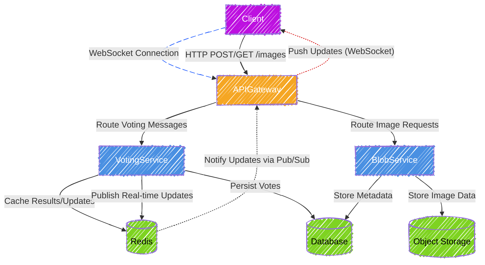

<h1 style="width: 100%; text-align: center;">Realtime polling system with GO</h1>

## High-level design


```
polling-system-backend/
├── cmd/
│   └── server/
│       └── main.go          # Application entry point
├── internal/
│   ├── adapters/            # Adapters for external systems
│   │   ├── handlers/        # HTTP handlers (e.g., Gin)
│   │   │   ├── poll.go      # Poll-related endpoints
│   │   │   ├── vote.go      # Vote-related endpoints
│   │   │   └── auth.go      # Authentication endpoints
│   │   ├── repositories/    # Data persistence implementations
│   │   │   ├── mysql/       # MySQL database access
│   │   │   │   └── poll_repository.go
│   │   │   ├── redis/       # Redis caching
│   │   │   │   └── vote_cache.go
│   │   │   └── kafka/       # Kafka messaging
│   │   │       └── vote_producer.go
│   │   └── external/        # External service implementations
│   │       ├── minio/       # MinIO for image uploads
│   │       │   └── image_uploader.go
│   │       └── socketio/    # Socket.IO for real-time updates
│   │           └── broadcaster.go
│   ├── core/                # Core business logic
│   │   ├── domain/          # Domain entities
│   │   │   ├── poll.go      # Poll entity
│   │   │   ├── poll_option.go # Poll option entity
│   │   │   ├── vote.go      # Vote entity
│   │   │   └── user.go      # User entity
│   │   └── services/        # Application services (use cases)
│   │       ├── poll_service.go   # Poll-related logic
│   │       ├── vote_service.go   # Vote-related logic
│   │       └── auth_service.go   # Authentication logic
│   └── ports/               # Interfaces for external interactions
│       ├── repositories.go  # Repository interfaces
│       ├── services.go      # Service interfaces (optional)
│       └── external.go      # External service interfaces
├── pkg/                     # Shared utilities (optional)
│   ├── config/              # Configuration management
│   │   └── config.go
│   └── middleware/          # Middleware functions
│       └── auth.go          # Authentication middleware
└── go.mod                   # Go module file
```
