<h1 style="width: 100%; text-align: center;">Real-time Chat Application with Go & Next.js</h1>

# Project Notify - Chat Service

A modern real-time chat application built with Go backend and Next.js frontend, featuring WebSocket communication, user authentication, and channel-based messaging.

## Getting Started

These instructions will get you a copy of the project up and running on your local machine for development and testing purposes.

## High-level Architecture

```mermaid
%%{
  init: {
    'theme': 'forest',
    'themeVariables': {
      'primaryColor': '#BB2528',
      'primaryTextColor': '#000',
    }
  }
}%%
flowchart TD
    %% Client Layer
    subgraph Client Layer
        A[🖥️ Next.js Frontend<br/>React Chat Client]
    end
    style A fill:#E3F2FD,stroke:#1E88E5,stroke-width:2px

    %% API Gateway Layer
    subgraph API Gateway Layer
        B[🌐 NGINX Reverse Proxy<br/>& Load Balancer]
    end
    style B fill:#E1F5FE,stroke:#0288D1,stroke-width:2px

    %% Backend Services Layer
    subgraph Backend Services
        C[🔄 Chat API Service<br/>Golang/Gin]
        G[📡 WebSocket Service<br/>Real-time Messaging<br/>Golang]
        D[📨 Message Broker<br/>Apache Kafka]
        E[📊 Aggregation Service<br/>Golang]
    end
    style C fill:#E8F5E9,stroke:#2E7D32,stroke-width:2px
    style G fill:#F3E5F5,stroke:#8E24AA,stroke-width:2px
    style D fill:#FFF3E0,stroke:#F57C00,stroke-width:2px
    style E fill:#F1F8E9,stroke:#33691E,stroke-width:2px

    %% Supporting Infrastructure Layer
    subgraph Infrastructure
        F[⚡ Redis Cache<br/>Session & Real-time Data]
        H[🗄️ PostgreSQL Database<br/>Users, Channels, Messages]
        I[📁 MinIO Object Storage<br/>File Attachments]
    end
    style F fill:#FBE9E7,stroke:#D84315,stroke-width:2px
    style H fill:#ECEFF1,stroke:#455A64,stroke-width:2px
    style I fill:#E8F5E9,stroke:#388E3C,stroke-width:2px

    %% Connections
    A -- "HTTP API & WebSocket" --> B
    B --> C
    B --> G

    %% Chat API Service interactions
    C -- "User Auth & Data" --> H
    C -- "Cache Sessions" --> F
    C -- "File Storage" --> I

    %% WebSocket Service interactions
    G -- "Real-time Messages" --> A
    G -- "Message Persistence" --> H
    G -- "Cache Active Users" --> F

    %% Message Processing Pipeline
    C -- "Message Events" --> D
    D --> E
    E -- "Analytics & Aggregation" --> H

```



## Project Structure

```plaintext
Notify/
├── README.md                      # Project documentation
├── deployments/                   # Deployment configurations
│   ├── README.md                  # Deployment guide and documentation
│   ├── nginx.conf                 # NGINX reverse proxy configuration
│   ├── docker/                    # Docker deployment files
│   │   ├── docker-compose.yml     # Complete service orchestration
│   │   └── .env.example           # Environment variables template
│   └── k8s/                       # Kubernetes deployment configurations
│       ├── deployment.yml         # Kubernetes deployment manifest
│       └── service.yml            # Kubernetes service manifest
├── frontend/                      # Next.js React frontend application
│   ├── Dockerfile                 # Multi-stage optimized container build
│   ├── package.json               # Node.js dependencies and scripts
│   ├── next.config.mjs            # Next.js configuration (standalone output)
│   ├── tailwind.config.ts         # Tailwind CSS configuration
│   ├── tsconfig.json              # TypeScript configuration
│   ├── components.json            # UI components configuration
│   ├── orval.config.ts            # API client generation config
│   ├── public/                    # Static assets
│   │   ├── images/                # Image assets
│   │   └── *.svg                  # Icon files
│   ├── src/                       # Source code
│   │   ├── app/                   # Next.js App Router pages
│   │   │   ├── (auth)/            # Authentication pages (login, register)
│   │   │   ├── api/               # API routes
│   │   │   │   └── health/        # Health check endpoint
│   │   │   ├── messages/          # Chat messages pages
│   │   │   ├── layout.tsx         # Root layout component
│   │   │   └── page.tsx           # Home page
│   │   ├── components/            # React components (Atomic Design)
│   │   │   ├── atoms/             # Basic UI elements
│   │   │   ├── molecules/         # Component combinations
│   │   │   ├── organisms/         # Complex components
│   │   │   ├── templates/         # Page templates
│   │   │   └── ui/                # Reusable UI components
│   │   ├── hooks/                 # Custom React hooks
│   │   ├── lib/                   # Utility libraries
│   │   │   ├── supabase/          # Supabase client configuration
│   │   │   └── utils/             # Helper functions
│   │   ├── services/              # API services and WebSocket
│   │   │   ├── endpoints/         # API endpoint definitions
│   │   │   ├── schemas/           # Data validation schemas
│   │   │   ├── types/             # TypeScript type definitions
│   │   │   ├── websocket/         # WebSocket client implementation
│   │   │   └── axios-config.ts    # HTTP client configuration
│   │   ├── store/                 # State management (Zustand)
│   │   │   ├── useAuthStore.ts    # Authentication state
│   │   │   ├── useChannelStore.ts # Channel management state
│   │   │   ├── useChatStore.ts    # Chat messages state
│   │   │   └── useSocketStore.ts  # WebSocket connection state
│   │   └── types/                 # Global TypeScript types
│   └── docs/                      # Frontend documentation
├── chat-service/                  # Go backend service
│   ├── Makefile                   # Build and development commands
│   ├── go.mod                     # Go module dependencies
│   ├── go.sum                     # Go module checksums
│   ├── cmd/                       # Application entry points
│   │   ├── server/                # Main server application
│   │   ├── migrate/               # Database migration tool
│   │   └── seed/                  # Database seeding tool
│   ├── internal/                  # Private application code
│   │   ├── api/                   # HTTP API layer
│   │   │   ├── handlers/          # HTTP request handlers
│   │   │   ├── middleware/        # HTTP middleware
│   │   │   └── routes/            # Route definitions
│   │   ├── config/                # Configuration management
│   │   ├── database/              # Database connections and migrations
│   │   ├── models/                # Data models and structs
│   │   ├── repositories/          # Data access layer
│   │   │   └── postgres/          # PostgreSQL implementations
│   │   ├── services/              # Business logic layer
│   │   ├── utils/                 # Utility functions
│   │   └── websocket/             # WebSocket implementation
│   │       ├── client.go          # WebSocket client management
│   │       ├── hub.go             # WebSocket hub/broker
│   │       ├── handlers.go        # WebSocket message handlers
│   │       └── channel.go         # Channel management
│   ├── tests/                     # Test files
│   │   └── unit/                  # Unit tests
│   ├── docs/                      # API documentation (Swagger)
│   └── Dockerfile                 # Optimized multi-stage container build
```

## Architecture Overview

### Frontend Layer

- **Next.js React Application:**
  - Modern React-based chat interface with real-time messaging
  - Built with TypeScript, Tailwind CSS, and Radix UI components
  - Implements Atomic Design pattern for component organization
  - Features authentication, channel management, and file sharing
  - Uses Zustand for state management and Socket.IO for real-time communication

### API Gateway Layer

- **NGINX Reverse Proxy:**
  - Routes HTTP requests and WebSocket connections between frontend and backend
  - Handles CORS and security headers
  - Serves static assets with caching optimization
  - Provides health check endpoints and error handling

### Backend Services

- **Chat Service (Golang):**
  - **Container**: `notify-chat-service` (Port 8080)
  - RESTful API built with Gin framework
  - Integrated WebSocket service for real-time messaging
  - Handles user authentication with JWT tokens
  - Manages channels, messages, and user profiles
  - Integrates with PostgreSQL for data persistence
  - Uses Redis for caching and session management
  - Provides Swagger/OpenAPI documentation
  - Health checks and graceful shutdown support

### Infrastructure Services

- **PostgreSQL Database:**

  - **Container**: `notify-chat-db` (Port 5432)
  - Primary data store for users, channels, messages, and metadata
  - Supports ACID transactions and complex queries
  - Persistent volume for data storage
  - Automatic initialization and migrations

- **Redis Cache:**
  - **Container**: `notify-chat-redis` (Port 6379)
  - Caches user sessions and authentication tokens
  - Stores real-time data for active users and channels
  - Provides fast access to frequently accessed data
  - Supports WebSocket scaling across multiple instances

### Development & Deployment

- **Containerization:**

  - All services containerized with optimized multi-stage Docker builds
  - Frontend: Standalone Next.js build with minimal runtime image
  - Backend: Static Go binary in Alpine Linux for security and size
  - Non-root users and health checks for production readiness

- **Local Development:**

  - Complete Docker Compose orchestration in `deployments/docker/`
  - Automatic service discovery and networking
  - Environment variable templates for easy setup
  - Comprehensive logging and monitoring

- **Production Deployment:**
  - Kubernetes manifests available in `deployments/k8s/`
  - Nginx reverse proxy with security headers and CORS
  - Health checks and graceful shutdown for all services
  - Scalable architecture with Redis-backed session management

## Prerequisites

Before running this project, make sure you have the following installed:

- **Docker & Docker Compose** (v20.10+ recommended)
- **Node.js** (v18+ for frontend development)
- **Go** (v1.23+ for backend development)
- **Git** for version control

## Quick Start

### 1. Clone the Repository

```bash
git clone <repository-url>
cd Notify
```

### 2. Environment Setup

Navigate to the deployment directory and set up environment variables:

```bash
cd deployments/docker

# Copy the example environment file
cp .env.example .env

# Edit the .env file with your configuration
# IMPORTANT: Change default passwords and secrets in production!
nano .env
```

The `.env` file should contain:

```env
# Application Configuration
NODE_ENV=production
NEXT_TELEMETRY_DISABLED=1

# Frontend Configuration
NEXT_PUBLIC_API_URL=http://localhost:8080
NEXT_PUBLIC_WS_URL=ws://localhost:8080

# Backend Configuration
NOTIFY_HOST=0.0.0.0
NOTIFY_PORT=8080
NOTIFY_JWT_SECRET=your-super-secure-jwt-secret-key-change-in-production
NOTIFY_JWT_EXPIRE=24h

# Database Configuration (PostgreSQL)
POSTGRES_URL=postgres://postgres:postgres@db:5432/postgres?sslmode=disable
POSTGRES_USER=postgres
POSTGRES_PASSWORD=postgres
POSTGRES_DB=postgres

# Redis Configuration
REDIS_URL=redis://redis:6379/0
```

### 3. Start All Services

```bash
# Start all services with Docker Compose (from deployments/docker directory)
docker compose up -d

# Check service status
docker compose ps

# View logs
docker compose logs -f
```

### 4. Initialize Database

The database will be automatically initialized when the services start. If you need to run migrations manually:

```bash
# Navigate to chat-service directory
cd ../../chat-service

# Run database migrations
make migrate

# Seed initial data (optional)
make seed
```

### 5. Generate API Documentation (Optional)

```bash
# Generate and sync API documentation between backend and frontend
cd frontend
npm run sync:api
```

### 6. Access the Application

- **Main Application (via Nginx)**: http://localhost:80
- **Frontend (Direct)**: http://localhost:3000
- **Backend API**: http://localhost:8080
- **API Documentation**: http://localhost:8080/swagger/index.html
- **Database**: localhost:5432 (postgres/postgres)
- **Redis**: localhost:6379

> 💡 **Recommended**: Use the main application URL (port 80) which routes through Nginx for the complete experience with proper load balancing and static asset serving.

## Deployment Documentation

For detailed deployment instructions, troubleshooting, and production considerations, see:

📖 **[Deployment Guide](deployments/README.md)** - Comprehensive guide covering:

- Detailed setup instructions
- Environment configuration
- Service architecture
- Troubleshooting common issues
- Production deployment best practices
- Scaling and monitoring

## Development Setup

### Frontend Development

```bash
cd frontend

# Install dependencies
npm install

# Start development server
npm run dev

# Generate API client from backend
npm run gen:api

# Build for production
npm run build
```

### Backend Development

```bash
cd chat-service

# Install dependencies
go mod download

# Run development server
make dev

# Run tests
make test

# Build binary
make build

# Generate Swagger docs
make swagger
```

## API Documentation Workflow

This project maintains synchronized API documentation between the Go backend and TypeScript frontend using an automated workflow that ensures version consistency.

### Overview

The workflow converts backend Swagger 2.0 documentation to OpenAPI 3.0.1 format for frontend consumption:

1. **Backend**: Generates Swagger 2.0 from Go code annotations
2. **Conversion**: Automatically converts to OpenAPI 3.0.1 format
3. **Frontend**: Generates TypeScript API clients from OpenAPI 3.0.1

### Quick Commands

#### Complete Workflow (Recommended)

```bash
# From frontend directory - runs entire workflow
cd frontend
npm run sync:api
```

This single command will:

- Generate backend Swagger documentation
- Convert to OpenAPI 3.0.1 format
- Sync to frontend docs directory
- Generate TypeScript API clients

#### Manual Steps

```bash
# 1. Generate backend documentation
cd chat-service
make swagger-sync

# 2. Generate frontend API clients
cd ../frontend
npm run gen:api
```

### Prerequisites

**Backend Requirements:**

- Go 1.23+ installed
- `swag` tool installed (run `make dev-tools` in chat-service)

**Frontend Requirements:**

- Node.js 18+ installed
- Dependencies installed (`npm install`)

### File Locations

| Component             | Location                           | Format        |
| --------------------- | ---------------------------------- | ------------- |
| Backend Swagger       | `chat-service/docs/swagger.json`   | Swagger 2.0   |
| Frontend OpenAPI      | `frontend/docs/swagger.json`       | OpenAPI 3.0.1 |
| Generated API Clients | `frontend/src/services/endpoints/` | TypeScript    |

### Available Commands

#### Backend Commands

```bash
cd chat-service

# Generate Swagger 2.0 documentation only
make swagger

# Generate docs and sync to frontend (recommended)
make swagger-sync
```

#### Frontend Commands

```bash
cd frontend

# Generate TypeScript API clients from existing OpenAPI spec
npm run gen:api

# Complete workflow: backend generation + frontend sync + client generation
npm run sync:api
```

### Generated API Clients

The workflow generates TypeScript API clients with:

- **Type-safe interfaces** for all API endpoints
- **React Query hooks** using @tanstack/react-query
- **Automatic request/response typing** based on OpenAPI schemas
- **Error handling** with proper TypeScript types

Example generated hook usage:

```typescript
import { useAuthLogin } from "@/services/endpoints/auth/auth";

const LoginComponent = () => {
  const loginMutation = useAuthLogin();

  const handleLogin = (credentials) => {
    loginMutation.mutate(credentials, {
      onSuccess: (data) => {
        // Handle successful login
      },
      onError: (error) => {
        // Handle login error
      },
    });
  };

  return (
    <button onClick={handleLogin} disabled={loginMutation.isPending}>
      {loginMutation.isPending ? "Logging in..." : "Login"}
    </button>
  );
};
```

### Troubleshooting

#### Common Issues

**"swag command not found"**

```bash
cd chat-service
make dev-tools  # Installs swag and other development tools
```

**"Invalid OpenAPI specification"**

- Check Go code annotations in handler files
- Verify main.go has proper swagger comments
- Run `make swagger` to see generation errors

**"orval generation failed"**

- Ensure `frontend/docs/swagger.json` exists and is valid
- Check `orval.config.ts` configuration
- Verify OpenAPI 3.0 format in the frontend docs file

**"API client types are outdated"**

```bash
# Regenerate everything from scratch
cd frontend
npm run sync:api
```

### When to Run the Workflow

Run the API documentation workflow when:

- Adding new API endpoints in the backend
- Modifying existing API request/response schemas
- Updating API documentation or comments
- Setting up the project for the first time
- After pulling changes that affect the API

## API Documentation

The backend provides comprehensive API documentation through Swagger/OpenAPI:

- **Swagger UI**: http://localhost:8080/swagger/index.html
- **OpenAPI JSON**: http://localhost:8080/swagger/doc.json

> 📋 **For API development workflow**: See the [API Documentation Workflow](#api-documentation-workflow) section above for instructions on generating and syncing API documentation between backend and frontend.

Key API endpoints include:

- `POST /api/v1/auth/login` - User authentication
- `POST /api/v1/auth/register` - User registration
- `GET /api/v1/channels` - List channels
- `POST /api/v1/channels` - Create channel
- `GET /api/v1/messages/{channelId}` - Get channel messages
- `POST /api/v1/messages` - Send message
- `WS /ws` - WebSocket connection for real-time messaging

## Key Features

### 🔐 Authentication & Authorization

- JWT-based authentication system
- Secure user registration and login
- Session management with Redis
- Protected routes and API endpoints

### 💬 Real-time Messaging

- WebSocket-based real-time communication
- Channel-based message organization
- Message persistence and history
- Typing indicators and user presence
- File attachments and media sharing

### 🏗️ Scalable Architecture

- Containerized microservices with Docker
- Nginx reverse proxy for load balancing and routing
- Redis-backed session management for horizontal scaling
- WebSocket support with real-time message broadcasting
- Health checks and graceful shutdown for reliability

### 🎨 Modern Frontend

- Responsive design with Tailwind CSS
- Component-based architecture (Atomic Design)
- Real-time UI updates with WebSocket integration
- Optimized production builds with standalone output
- Health monitoring and error handling

### 📊 Data Management

- PostgreSQL for reliable data persistence
- Redis for high-performance caching and session storage
- Automatic database migrations and initialization
- Persistent volumes for data durability

## Technology Stack

### Frontend

- **Framework**: Next.js 15 with App Router
- **Language**: TypeScript
- **Styling**: Tailwind CSS
- **UI Components**: Radix UI
- **State Management**: Zustand
- **Real-time**: Socket.IO Client
- **HTTP Client**: Axios
- **Build Tool**: Next.js built-in bundler

### Backend

- **Language**: Go 1.23
- **Web Framework**: Gin
- **WebSocket**: Gorilla WebSocket
- **Database ORM**: GORM
- **Authentication**: JWT (golang-jwt)
- **Documentation**: Swagger/OpenAPI
- **Configuration**: Viper

### Infrastructure

- **Database**: PostgreSQL 15 Alpine
- **Cache**: Redis 7 Alpine
- **Reverse Proxy**: Nginx Alpine
- **Containerization**: Docker & Docker Compose
- **Orchestration**: Kubernetes (manifests available)
- **Networking**: Custom Docker bridge network
- **Storage**: Named volumes for data persistence

### Development Tools

- **API Generation**: Orval (OpenAPI client generation)
- **Code Quality**: ESLint, Prettier (Frontend)
- **Testing**: Go testing framework
- **Documentation**: Swagger UI
- **Database Management**: phpMyAdmin

## Contributing

1. Fork the repository
2. Create a feature branch (`git checkout -b feature/amazing-feature`)
3. Commit your changes (`git commit -m 'Add some amazing feature'`)
4. Push to the branch (`git push origin feature/amazing-feature`)
5. Open a Pull Request

## License

This project is licensed under the MIT License - see the [LICENSE](LICENSE) file for details.

## Support

For support and questions:

- Create an issue in the GitHub repository
- Check the API documentation at `/swagger/index.html`
- Review the frontend and backend README files for specific setup instructions
