<h1 style="width: 100%; text-align: center;">Real-time Chat Application with Go & Next.js</h1>

# Project Notify - Chat Service

A modern real-time chat application built with Go backend and Next.js frontend, featuring WebSocket communication, user authentication, and channel-based messaging.

## Getting Started

These instructions will get you a copy of the project up and running on your local machine for development and testing purposes.

## High-level Architecture

```mermaid
%%{
  init: {
    'theme': 'forest',
    'themeVariables': {
      'primaryColor': '#BB2528',
      'primaryTextColor': '#000',
    }
  }
}%%
flowchart TD
    %% Client Layer
    subgraph Client Layer
        A[🖥️ Next.js Frontend<br/>React Chat Client]
    end
    style A fill:#E3F2FD,stroke:#1E88E5,stroke-width:2px

    %% API Gateway Layer
    subgraph API Gateway Layer
        B[🌐 NGINX Reverse Proxy<br/>& Load Balancer]
    end
    style B fill:#E1F5FE,stroke:#0288D1,stroke-width:2px

    %% Backend Services Layer
    subgraph Backend Services
        C[🔄 Chat API Service<br/>Golang/Gin]
        G[📡 WebSocket Service<br/>Real-time Messaging<br/>Golang]
        D[📨 Message Broker<br/>Apache Kafka]
        E[📊 Aggregation Service<br/>Golang]
    end
    style C fill:#E8F5E9,stroke:#2E7D32,stroke-width:2px
    style G fill:#F3E5F5,stroke:#8E24AA,stroke-width:2px
    style D fill:#FFF3E0,stroke:#F57C00,stroke-width:2px
    style E fill:#F1F8E9,stroke:#33691E,stroke-width:2px

    %% Supporting Infrastructure Layer
    subgraph Infrastructure
        F[⚡ Redis Cache<br/>Session & Real-time Data]
        H[🗄️ PostgreSQL Database<br/>Users, Channels, Messages]
        I[📁 MinIO Object Storage<br/>File Attachments]
    end
    style F fill:#FBE9E7,stroke:#D84315,stroke-width:2px
    style H fill:#ECEFF1,stroke:#455A64,stroke-width:2px
    style I fill:#E8F5E9,stroke:#388E3C,stroke-width:2px

    %% Connections
    A -- "HTTP API & WebSocket" --> B
    B --> C
    B --> G

    %% Chat API Service interactions
    C -- "User Auth & Data" --> H
    C -- "Cache Sessions" --> F
    C -- "File Storage" --> I

    %% WebSocket Service interactions
    G -- "Real-time Messages" --> A
    G -- "Message Persistence" --> H
    G -- "Cache Active Users" --> F

    %% Message Processing Pipeline
    C -- "Message Events" --> D
    D --> E
    E -- "Analytics & Aggregation" --> H

```



## Project Structure

```plaintext
Notify/
├── README.md                      # Project documentation
├── docker-compose.yml             # Local development orchestration
├── nginx.conf                     # NGINX reverse proxy configuration
├── kafka-init.sh                  # Kafka initialization script
├── docs/                          # Project documentation
├── k8s/                           # Kubernetes deployment configurations
│   ├── k8s-deployment.yml         # Main Kubernetes deployment
│   └── minio-deployment.yml       # MinIO object storage deployment
├── frontend/                      # Next.js React frontend application
│   ├── Dockerfile                 # Frontend container configuration
│   ├── package.json               # Node.js dependencies and scripts
│   ├── next.config.mjs            # Next.js configuration
│   ├── tailwind.config.ts         # Tailwind CSS configuration
│   ├── tsconfig.json              # TypeScript configuration
│   ├── components.json            # UI components configuration
│   ├── orval.config.ts            # API client generation config
│   ├── public/                    # Static assets
│   │   ├── images/                # Image assets
│   │   └── *.svg                  # Icon files
│   ├── src/                       # Source code
│   │   ├── app/                   # Next.js App Router pages
│   │   │   ├── (auth)/            # Authentication pages (login, register)
│   │   │   ├── messages/          # Chat messages pages
│   │   │   ├── layout.tsx         # Root layout component
│   │   │   └── page.tsx           # Home page
│   │   ├── components/            # React components (Atomic Design)
│   │   │   ├── atoms/             # Basic UI elements
│   │   │   ├── molecules/         # Component combinations
│   │   │   ├── organisms/         # Complex components
│   │   │   ├── templates/         # Page templates
│   │   │   └── ui/                # Reusable UI components
│   │   ├── hooks/                 # Custom React hooks
│   │   ├── lib/                   # Utility libraries
│   │   │   ├── supabase/          # Supabase client configuration
│   │   │   └── utils/             # Helper functions
│   │   ├── services/              # API services and WebSocket
│   │   │   ├── endpoints/         # API endpoint definitions
│   │   │   ├── schemas/           # Data validation schemas
│   │   │   ├── types/             # TypeScript type definitions
│   │   │   ├── websocket/         # WebSocket client implementation
│   │   │   └── axios-config.ts    # HTTP client configuration
│   │   ├── store/                 # State management (Zustand)
│   │   │   ├── useAuthStore.ts    # Authentication state
│   │   │   ├── useChannelStore.ts # Channel management state
│   │   │   ├── useChatStore.ts    # Chat messages state
│   │   │   └── useSocketStore.ts  # WebSocket connection state
│   │   └── types/                 # Global TypeScript types
│   └── docs/                      # Frontend documentation
├── chat-service/                  # Go backend service
│   ├── Makefile                   # Build and development commands
│   ├── go.mod                     # Go module dependencies
│   ├── go.sum                     # Go module checksums
│   ├── cmd/                       # Application entry points
│   │   ├── server/                # Main server application
│   │   ├── migrate/               # Database migration tool
│   │   └── seed/                  # Database seeding tool
│   ├── internal/                  # Private application code
│   │   ├── api/                   # HTTP API layer
│   │   │   ├── handlers/          # HTTP request handlers
│   │   │   ├── middleware/        # HTTP middleware
│   │   │   └── routes/            # Route definitions
│   │   ├── config/                # Configuration management
│   │   ├── database/              # Database connections and migrations
│   │   ├── models/                # Data models and structs
│   │   ├── repositories/          # Data access layer
│   │   │   └── postgres/          # PostgreSQL implementations
│   │   ├── services/              # Business logic layer
│   │   ├── utils/                 # Utility functions
│   │   └── websocket/             # WebSocket implementation
│   │       ├── client.go          # WebSocket client management
│   │       ├── hub.go             # WebSocket hub/broker
│   │       ├── handlers.go        # WebSocket message handlers
│   │       └── channel.go         # Channel management
│   ├── tests/                     # Test files
│   │   └── unit/                  # Unit tests
│   ├── docs/                      # API documentation (Swagger)
│   └── deployments/               # Deployment configurations
│       ├── docker/                # Docker configurations
│       └── k8s/                   # Kubernetes manifests
```

## Architecture Overview

### Frontend Layer

- **Next.js React Application:**
  - Modern React-based chat interface with real-time messaging
  - Built with TypeScript, Tailwind CSS, and Radix UI components
  - Implements Atomic Design pattern for component organization
  - Features authentication, channel management, and file sharing
  - Uses Zustand for state management and Socket.IO for real-time communication

### API Gateway Layer

- **NGINX Reverse Proxy:**
  - Routes HTTP requests and WebSocket connections to backend services
  - Handles load balancing and SSL termination
  - Serves static assets and provides caching

### Backend Services

- **Chat API Service (Golang):**

  - RESTful API built with Gin framework
  - Handles user authentication with JWT tokens
  - Manages channels, messages, and user profiles
  - Integrates with PostgreSQL for data persistence
  - Provides Swagger/OpenAPI documentation

- **WebSocket Service (Golang):**

  - Real-time messaging using Gorilla WebSocket
  - Manages client connections and message broadcasting
  - Implements channel-based message routing
  - Handles user presence and typing indicators

- **Message Broker (Apache Kafka):**

  - Handles asynchronous message processing and event streaming
  - Enables scalable message distribution across services

- **Aggregation Service (Golang):**
  - Processes message events from Kafka
  - Generates analytics and message statistics
  - Handles data aggregation for reporting

### Infrastructure Services

- **PostgreSQL Database:**

  - Primary data store for users, channels, messages, and metadata
  - Supports ACID transactions and complex queries
  - Includes database migrations and seeding tools

- **Redis Cache:**

  - Caches user sessions and authentication tokens
  - Stores real-time data for active users and channels
  - Provides fast access to frequently accessed data

- **MinIO Object Storage:**
  - S3-compatible object storage for file attachments
  - Handles image uploads, documents, and media files
  - Provides secure file access with presigned URLs

### Development & Deployment

- **Containerization:**

  - All services are containerized with Docker
  - Multi-stage builds for optimized production images

- **Local Development:**

  - Docker Compose orchestrates all services locally
  - Includes development databases, Redis, and Kafka
  - Hot reload for both frontend and backend development

- **Production Deployment:**
  - Kubernetes manifests for scalable deployment
  - Separate configurations for different environments
  - Health checks and service discovery

## Prerequisites

Before running this project, make sure you have the following installed:

- **Docker & Docker Compose** (v20.10+ recommended)
- **Node.js** (v18+ for frontend development)
- **Go** (v1.23+ for backend development)
- **Git** for version control

## Quick Start

### 1. Clone the Repository

```bash
git clone <repository-url>
cd Notify
```

### 2. Environment Setup

Create a `.env` file in the root directory with the following variables:

```env
# Database Configuration
NOTIFY_MYSQL_ROOT_PASSWORD=rootpassword
NOTIFY_MYSQL_DATABASE=notify_db
NOTIFY_MYSQL_USER=notify_user
NOTIFY_MYSQL_PASSWORD=notify_password

# Redis Configuration
NOTIFY_REDIS_PASSWORD=redis_password

# MinIO Configuration
NOTIFY_MINIO_ROOT_USER=minioadmin
NOTIFY_MINIO_ROOT_PASSWORD=minioadmin123

# Service Configuration
NOTIFY_SERVICE_PORT=8080
NOTIFY_PHPMYADMIN_PORT=8000

# JWT Configuration
NOTIFY_JWT_SECRET=your-super-secret-jwt-key-here
```

### 3. Start All Services

```bash
# Start all services with Docker Compose
docker-compose up -d

# Check service status
docker-compose ps
```

### 4. Initialize Database

```bash
# Run database migrations
cd chat-service
make migrate

# Seed initial data (optional)
make seed
```

### 5. Access the Application

- **Frontend**: http://localhost:3000
- **Backend API**: http://localhost:8080
- **API Documentation**: http://localhost:8080/swagger/index.html
- **phpMyAdmin**: http://localhost:8000
- **Kafka UI**: http://localhost:8082
- **MinIO Console**: http://localhost:9001

## Development Setup

### Frontend Development

```bash
cd frontend

# Install dependencies
npm install

# Start development server
npm run dev

# Generate API client from backend
npm run gen:api

# Build for production
npm run build
```

### Backend Development

```bash
cd chat-service

# Install dependencies
go mod download

# Run development server
make dev

# Run tests
make test

# Build binary
make build

# Generate Swagger docs
make swagger
```

## Available Services

| Service      | Port      | Description                  |
| ------------ | --------- | ---------------------------- |
| Frontend     | 3000      | Next.js React application    |
| Chat Service | 8080      | Go backend API and WebSocket |
| PostgreSQL   | 5432      | Primary database             |
| Redis        | 6379      | Cache and session store      |
| Kafka        | 9092      | Message broker               |
| MinIO        | 9000/9001 | Object storage               |
| phpMyAdmin   | 8000      | Database management          |
| Kafka UI     | 8082      | Kafka cluster management     |

## API Documentation

The backend provides comprehensive API documentation through Swagger/OpenAPI:

- **Swagger UI**: http://localhost:8080/swagger/index.html
- **OpenAPI JSON**: http://localhost:8080/swagger/doc.json

Key API endpoints include:

- `POST /api/v1/auth/login` - User authentication
- `POST /api/v1/auth/register` - User registration
- `GET /api/v1/channels` - List channels
- `POST /api/v1/channels` - Create channel
- `GET /api/v1/messages/{channelId}` - Get channel messages
- `POST /api/v1/messages` - Send message
- `WS /ws` - WebSocket connection for real-time messaging

## Key Features

### 🔐 Authentication & Authorization

- JWT-based authentication system
- Secure user registration and login
- Session management with Redis
- Protected routes and API endpoints

### 💬 Real-time Messaging

- WebSocket-based real-time communication
- Channel-based message organization
- Message persistence and history
- Typing indicators and user presence
- File attachments and media sharing

### 🏗️ Scalable Architecture

- Microservices architecture with Go
- Event-driven messaging with Kafka
- Horizontal scaling capabilities
- Load balancing with NGINX

### 🎨 Modern Frontend

- Responsive design with Tailwind CSS
- Component-based architecture (Atomic Design)
- Real-time UI updates
- Dark/light theme support
- Mobile-friendly interface

### 📊 Data Management

- PostgreSQL for reliable data persistence
- Redis for high-performance caching
- MinIO for scalable file storage
- Database migrations and seeding

## Technology Stack

### Frontend

- **Framework**: Next.js 15 with App Router
- **Language**: TypeScript
- **Styling**: Tailwind CSS
- **UI Components**: Radix UI
- **State Management**: Zustand
- **Real-time**: Socket.IO Client
- **HTTP Client**: Axios
- **Build Tool**: Next.js built-in bundler

### Backend

- **Language**: Go 1.23
- **Web Framework**: Gin
- **WebSocket**: Gorilla WebSocket
- **Database ORM**: GORM
- **Authentication**: JWT (golang-jwt)
- **Documentation**: Swagger/OpenAPI
- **Configuration**: Viper

### Infrastructure

- **Database**: PostgreSQL 15
- **Cache**: Redis 7
- **Message Broker**: Apache Kafka
- **Object Storage**: MinIO
- **Reverse Proxy**: NGINX
- **Containerization**: Docker & Docker Compose
- **Orchestration**: Kubernetes

### Development Tools

- **API Generation**: Orval (OpenAPI client generation)
- **Code Quality**: ESLint, Prettier (Frontend)
- **Testing**: Go testing framework
- **Documentation**: Swagger UI
- **Database Management**: phpMyAdmin

## Contributing

1. Fork the repository
2. Create a feature branch (`git checkout -b feature/amazing-feature`)
3. Commit your changes (`git commit -m 'Add some amazing feature'`)
4. Push to the branch (`git push origin feature/amazing-feature`)
5. Open a Pull Request

## License

This project is licensed under the MIT License - see the [LICENSE](LICENSE) file for details.

## Support

For support and questions:

- Create an issue in the GitHub repository
- Check the API documentation at `/swagger/index.html`
- Review the frontend and backend README files for specific setup instructions
