<h1 style="width: 100%; text-align: center;">Realtime polling system with GO</h1>

# Project Votify

One Paragraph of project description goes here

## Getting Started

These instructions will get you a copy of the project up and running on your local machine for development and testing purposes. See deployment for notes on how to deploy the project on a live system.

## High-level design

```mermaid
flowchart TD
    %% Client Layer
    subgraph Client Layer
        A[🖥️ Next.js Frontend <br/> Client] 
    end
    style A fill:#E3F2FD,stroke:#1E88E5,stroke-width:2px

    %% API Gateway Layer
    subgraph API Gateway Layer
        B[🌐 NGINX API Gateway <br/> & Load Balancer]
    end
    style B fill:#E1F5FE,stroke:#0288D1,stroke-width:2px

    %% Backend Services
    subgraph Backend Services
        C[🔄 Vote API Service <br/> Golang]
    end
    style C fill:#E8F5E9,stroke:#2E7D32,stroke-width:2px

    %% Vote Processing Pipeline
    subgraph Vote Processing Pipeline
        D[📨 Message Broker <br/> Apache Kafka]
        E[📊 Vote Aggregation Service <br/> Golang]
        F[⚡ In-Memory Store <br/> Redis]
    end
    style D fill:#FFF3E0,stroke:#F57C00,stroke-width:2px
    style E fill:#F1F8E9,stroke:#33691E,stroke-width:2px
    style F fill:#FBE9E7,stroke:#D84315,stroke-width:2px

    %% Real-Time Notification
    subgraph Real-Time Notification
        G[📡 WebSocket Server <br/> Real-Time Notification Service Golang]
    end
    style G fill:#F3E5F5,stroke:#8E24AA,stroke-width:2px

    %% Monitoring & Logging
    subgraph Monitoring & Logging
        H[📈 Prometheus & Grafana]
    end
    style H fill:#ECEFF1,stroke:#455A64,stroke-width:2px

    %% Connections
    A -- "Vote Submission <br/> & Receive Updates" --> B
    B --> C
    C --> D
    D --> E
    E --> F
    F --> G
    G --> A

    %% Monitoring Connections
    C --- H
    E --- H
    F --- H
    G --- H

```



```
voting-service/
|____cmd/
| |____api/
| | |____main.go
|____internal/
| |____server/
| | |____middleware/
| | | |____cors.go
| | | |____auth.go
| | |____repository/
| | | |____user_repository.go
| | | |____voting_repository.go
| | | |____auth_repository.go
| | |____server.go
| | |____routes_test.go
| | |____routes.go
| | |____service/
| | | |____voting_service.go
| | | |____auth_service.go
| | |____handlers/
| | | |____auth_handler.go
| |____adapters/
| | |____database/
| | | |____database.go
| | | |____database_test.go
| | | |____minio.go
| | | |____migrate.go
| | |____utils/
| | | |____uuid.go
| |____ports/
| | |____dao/
| | | |____option_dao.go
| | | |____auth_dao.go
| | | |____topic_dao.go
| | |____models/
| | | |____option.go
| | | |____user.go
| | | |____topic.go
| | | |____vote.go
|____docs/
| |____swagger.yaml
| |____docs.go
| |____swagger.json
|____.env
|____go.mod
|____go.sum
|____Dockerfile
|____Makefile
|____README.md

```
