<h1 style="width: 100%; text-align: center;">Realtime polling system with GO</h1>

# Project Votify

One Paragraph of project description goes here

## Getting Started

These instructions will get you a copy of the project up and running on your local machine for development and testing purposes. See deployment for notes on how to deploy the project on a live system.

## High-level design

```mermaid
%%{
  init: {
    'theme': 'forest',
    'themeVariables': {
      'primaryColor': '#BB2528',
      'primaryTextColor': '#000',
    }
  }
}%%
flowchart TD
    %% Client Layer
    subgraph Client Layer
        A[🖥️ Next.js Frontend<br/>Client]
    end
    style A fill:#E3F2FD,stroke:#1E88E5,stroke-width:2px

    %% API Gateway Layer
    subgraph API Gateway Layer
        B[🌐 NGINX API Gateway<br/>& Load Balancer]
    end
    style B fill:#E1F5FE,stroke:#0288D1,stroke-width:2px

    %% Backend Services Layer
    subgraph Backend Services
        C[🔄 Vote API Service<br/>Golang]
        D[📨 Message Broker<br/>Apache Kafka]
        E[📊 Vote Aggregation Service<br/>Golang]
        G[📡 Realtime Notification<br/>WebSocket Service<br/>Golang]
    end
    style C fill:#E8F5E9,stroke:#2E7D32,stroke-width:2px
    style D fill:#FFF3E0,stroke:#F57C00,stroke-width:2px
    style E fill:#F1F8E9,stroke:#33691E,stroke-width:2px
    style G fill:#F3E5F5,stroke:#8E24AA,stroke-width:2px

    %% Supporting Infrastructure Layer
    subgraph Infrastructure
        F[⚡ In-Memory Cache<br/>Redis]
        H[🗄️ MySQL Database]
    end
    style F fill:#FBE9E7,stroke:#D84315,stroke-width:2px
    style H fill:#ECEFF1,stroke:#455A64,stroke-width:2px

    %% Connections
    A -- "Submit Vote & Request Results" --> B
    B --> C

    %% Vote API Service interactions
    C -- "Check Campaign<br/>(Start/End Times)" --> H
    C -- "Valid Vote Message" --> D

    %% Vote Processing Pipeline
    D --> E
    E -- "Store Final Vote Counts" --> H
    E -- "Update Cache" --> F

    %% Real-Time Updates
    F -- "Real-Time Data" --> G
    G -- "Push Updates" --> A

    %% Optional Monitoring & Logging (Not colored for brevity)
    C --- M[📈 Monitoring & Logging <br/> Prometheus & Grafana]
    E --- M
    G --- M

```



## Folder Structure

```plaintext
Votify/
├── README.md
├── .gitignore
├── docker-compose.yml             # Local orchestration including MySQL, Kafka, Redis, etc.
├── k8s/                           # Kubernetes deployment configurations
│   ├── namespaces.yaml
│   ├── mysql-deployment.yaml
│   ├── mysql-service.yaml
│   ├── frontend-deployment.yaml
│   ├── frontend-service.yaml
│   ├── vote-api-deployment.yaml
│   ├── vote-api-service.yaml
│   ├── vote-aggregator-deployment.yaml
│   ├── vote-aggregator-service.yaml
│   ├── realtime-notification-deployment.yaml
│   ├── realtime-notification-service.yaml
│   ├── kafka-deployment.yaml
│   ├── kafka-service.yaml
│   └── redis-deployment.yaml
├── frontend/                      # Next.js frontend code
│   ├── Dockerfile
│   ├── package.json
│   ├── next.config.js
│   ├── public/
│   └── src/
│       ├── components/
│       ├── pages/
│       └── styles/
├── backend/                       # Backend services code
│   ├── vote-api-service/          # Vote API Service (Golang)
│   │   ├── Dockerfile
│   │   ├── main.go
│   │   ├── go.mod
│   │   └── go.sum
│   ├── vote-aggregator-service/   # Vote Aggregation Service (Golang)
│   │   ├── Dockerfile
│   │   ├── main.go
│   │   ├── go.mod
│   │   └── go.sum
│   └── realtime-notification-service/   # Real-Time Notification (WebSocket)
│       ├── Dockerfile
│       ├── main.go
│       ├── go.mod
│       └── go.sum
├── infra/                         # Infrastructure configuration
│   ├── nginx/                     # NGINX API Gateway configuration
│   │   ├── Dockerfile
│   │   └── default.conf
│   ├── kafka/                     # Apache Kafka configuration
│   │   ├── Dockerfile
│   │   └── config/
│   │       └── server.properties
│   ├── redis/                     # Redis configuration
│   │   └── redis.conf
│   └── mysql/                     # MySQL configuration
│       ├── Dockerfile             # Optional (or use official image)
│       └── my.cnf
└── scripts/                       # Utility scripts for deployment
    └── deploy.sh
```

## Architecture Overview

### Client Layer
- **Next.js Frontend:**  
  - Provides a user interface for submitting votes and viewing real-time results.
  - Communicates with backend services through the NGINX API Gateway.

### API Gateway Layer
- **NGINX API Gateway & Load Balancer:**  
  - Routes incoming requests to the appropriate backend services.
  - Ensures efficient distribution of load across services.

### Backend Services
- **Vote API Service (Golang):**  
  - Receives vote submissions from the frontend.
  - Checks campaign metadata (start and end times) stored in MySQL before accepting votes.
  - Forwards valid votes to the Kafka message broker.

- **Message Broker (Apache Kafka):**  
  - Handles asynchronous vote processing by queuing vote messages.

- **Vote Aggregation Service (Golang):**  
  - Consumes vote messages from Kafka.
  - Aggregates votes in real time, temporarily caching results in Redis.
  - Persists final vote counts into MySQL after the campaign ends.

- **Realtime Notification Service (Golang WebSocket):**  
  - Pushes live updates to the frontend based on real-time data from Redis.

### Infrastructure Services
- **Redis:**  
  - Provides an in-memory cache for fast retrieval of real-time voting data.
- **MySQL:**  
  - Stores campaign metadata (vote topics, start/end times) and final vote results.
- **NGINX (Infra):**  
  - Configured as an API Gateway to route client requests.
  
### Additional Components
- **Monitoring & Logging:**  
  - Components such as Prometheus and Grafana can be attached to monitor system health and performance.
- **Time-Constrained Voting:**  
  - Each vote topic includes start and end times. Votes outside this window are rejected.
- **Deployment:**  
  - The system is containerized with Docker.
  - Local development uses Docker Compose for multi-container orchestration.
  - Production deployment is handled via Kubernetes with dedicated YAML configurations for each service.
