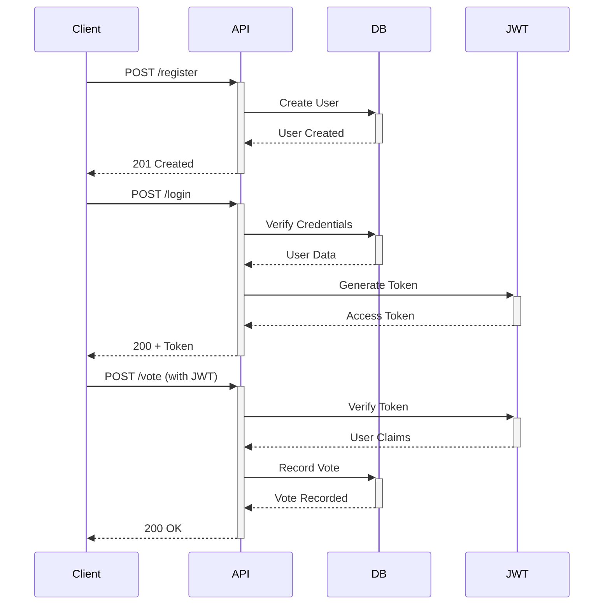

```mermaid
sequenceDiagram
    Client->>+API: POST /register
    API->>+DB: Create User
    DB-->>-API: User Created
    API-->>-Client: 201 Created

    Client->>+API: POST /login
    API->>+DB: Verify Credentials
    DB-->>-API: User Data
    API->>+JWT: Generate Token
    JWT-->>-API: Access Token
    API-->>-Client: 200 + Token

    Client->>+API: POST /vote (with JWT)
    API->>+JWT: Verify Token
    JWT-->>-API: User Claims
    API->>+DB: Record Vote
    DB-->>-API: Vote Recorded
    API-->>-Client: 200 OK
```
