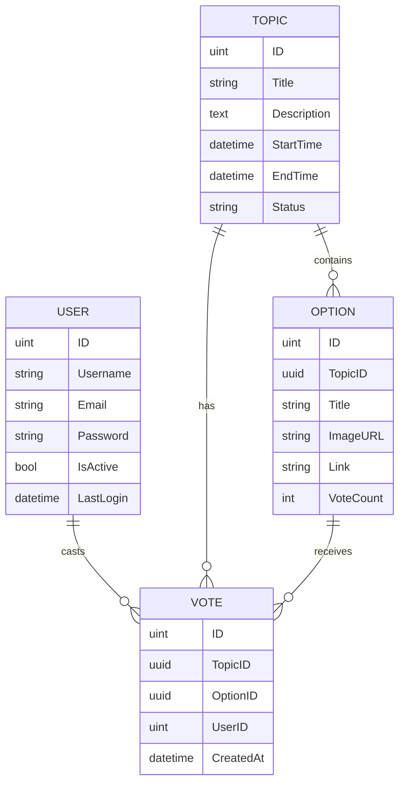

```mermaid
erDiagram
    USER ||--o{ VOTE : "casts"
    TOPIC ||--o{ OPTION : "contains"
    TOPIC ||--o{ VOTE : "has"
    OPTION ||--o{ VOTE : "receives"

    USER {
        uint ID
        string Username
        string Email
        string Password
        bool IsActive
        datetime LastLogin
    }

    TOPIC {
        uint ID
        string Title
        text Description
        datetime StartTime
        datetime EndTime
        string Status
    }

    OPTION {
        uint ID
        uuid TopicID
        string Title
        string ImageURL
        string Link
        int VoteCount
    }

    VOTE {
        uint ID
        uuid TopicID
        uuid OptionID
        uint UserID
        datetime CreatedAt
    }
```
